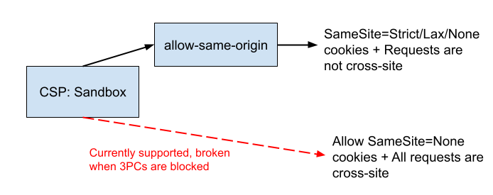
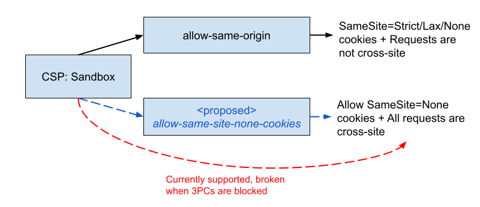

# Explainer for Allowing SameSite=None Cookies in Sandboxed Pages

## Participate
- https://github.com/explainers-by-googlers/csp-sandbox-allow-same-site-none-cookies/issues
- https://github.com/w3c/webappsec-csp/issues/664

## Table of Contents 
<!-- Update this table of contents by running `npx doctoc README.md` -->
<!-- START doctoc generated TOC please keep comment here to allow auto update -->
<!-- DON'T EDIT THIS SECTION, INSTEAD RE-RUN doctoc TO UPDATE -->

- [Introduction](#introduction)
- [Goals](#goals)
  - [CSP Sandbox Value](#csp-sandbox-value)
  - [Motivating scenario](#motivating-scenario)
- [Detailed design discussion](#detailed-design-discussion)
  - [Security and privacy considerations](#security-and-privacy-considerations)
- [Considered alternatives](#considered-alternatives)
    - [StorageAccess API](#storageaccess-api)
- [References & Acknowledgements](#references--acknowledgements)
  - [Links](#links)
  - [Definitions](#definitions)

<!-- END doctoc generated TOC please keep comment here to allow auto update -->

## Introduction
In order to prevent malicious attacks from untrusted content, servers can include a [Content-Security-Policy](https://www.w3.org/TR/CSP3/#content-security-policy) HTTP header to `sandbox` a page. This policy restricts popups, plugins, and scripts, and additionally results in the browser treating the page as an [opaque origin](https://html.spec.whatwg.org/multipage/browsers.html#concept-origin-opaque). Because of these policies, requests originating from this page cannot include `SameSite=Strict/Lax` cookies. Only `SameSite=None` cookies can be sent, since all requests from sandboxed pages without the `allow-same-origin` value are considered cross-site.

However, when third-party cookies (3PCs) are blocked, all requests from these sandboxed pages will no longer even have their `SameSite=None` cookies, since privacy controls in some browsers consider all subresource requests from a frame with an opaque origin to be cross-site for 3PC blocking. 

While an `allow-same-origin` sandbox value exists, this would expose the entire hosting origin’s cookie jar—`SameSite=Lax/Strict` cookies as well as `SameSite=None` cookies—while a website may have intentionally sandboxed an origin to prevent access to this storage. 

## Goals
### CSP Sandbox Value

We would like to introduce a method for servers to indicate to the browser that they wish a first-party sandboxed page to have access to its `SameSite=None` cookies using an API-based solution (such as an HTTP header). This preserves the current expected behavior and wouldn't pose an additional privacy concern because only cookie access from a first-party site would be allowed. 

We propose introducing a new value to the Content-Security-Policy `sandbox` directive which can be added to a frame to opt-in to sending `SameSite=None` cookies in sandboxed contexts. 

`Content-Security-Policy: sandbox allow-same-site-none-cookies;`

To implement this, the page’s host URL (instead of the opaque URL) is used to add cookies to browser-side storage and attach cookies to outgoing subresource requests. 

### Motivating scenario

Consider an example webpage at storage.example.com, where users can upload untrusted code and content. The site owners have sandboxed the untrusted content in order to block script execution. This also prevents these pages from accessing `SameSite` cookies, which could contain sensitive session and authentication information. However, storage.example.com uses `SameSite=None` cookies to access control content so that users can only display content they upload. 

When 3PCs are blocked, `SameSite=None` cookies are excluded from requests because they are treated as coming from a cross-site context. In this scenario, the owners cannot include the existing `allow-same-origin` value in storage.example.com’s CSP sandbox header as it would expose the `SameSite` cookie jar to untrusted web content. 

We would like to support a new CSP value in cases such as these where servers want to permit their own `SameSite=None` cookies in requests which are same-site to the top-level frame. storage.example.com could include the new value, `allow-same-site-none-cookies`, instructing the browser to only send `SameSite=None` cookies, restoring functionality without compromising security.

## Detailed design discussion

### Security and privacy considerations

This feature continues using the opaque origin in other sandboxing contexts so requests will be considered cross-site and the document will not be able to access other content from the same origin, which aligns with the current `sandbox` directive’s [specification](https://html.spec.whatwg.org/multipage/browsers.html#sandboxed-origin-browsing-context-flag). Since requests are considered cross-site, the browser can leverage network restrictions which already filter out `SameSite=Strict/Lax` cookies from opaque contexts to only include the `SameSite=None` cookies.

Since this value will only permit these cookies in frames that are same-site with the sandboxed document, there is no privacy impact to users as the cookies are exclusively the first-party site's  

Because this is opt-in behavior, developers can choose to allow this functionality in contexts where having `SameSite=None` cookies from the first-party site would not be a security concern. 

This feature does not change the cookies accessible to subresources and, in contrast to the cookies allowed by the `allow-same-origin` value, this proposed value would restore legacy behavior by not including `SameSite=Lax/Strict` cookies and treating all requests as cross-site. 

## Considered alternatives

#### StorageAccess API

Another approach could be to implement this functionality behind the [StorageAccess API](https://github.com/privacycg/storage-access) so sandboxed pages could request storage access through client-side JS. However, sandboxed pages do not have script access by default. Adding this feature in the StorageAccess API would require the additional sandbox `allow-scripts` value to be set which partially limits the benefits of the sandboxed context. 

Since the `sandbox` directive is part of the CSP, adding this feature there would make it easier for developers to incorporate regardless of other sandbox values and they could maintain access to the `SameSite=None` cookies without adding or modifying JS code. 

## References & Acknowledgements

### Links

External Discussion: https://github.com/w3c/webappsec-csp/issues/664
Current patch to re-enable functionality in Chromium through User Bypass: https://chromium-review.googlesource.com/c/chromium/src/+/5206483

### Definitions 

Fetch spec: [https://fetch.spec.whatwg.org/](https://fetch.spec.whatwg.org/)   
HTTP State Management Mechanism (RFC6265): [https://httpwg.org/specs/rfc6265.html](https://httpwg.org/specs/rfc6265.html)   
ITP: [https://webkit.org/blog/8613/intelligent-tracking-prevention-2-1/](https://webkit.org/blog/8613/intelligent-tracking-prevention-2-1/)   
Opaque Origin: [https://html.spec.whatwg.org/multipage/browsers.html\#concept-origin-opaque](https://html.spec.whatwg.org/multipage/browsers.html#concept-origin-opaque)   
SameSite=None Cookies: [https://web.dev/articles/samesite-cookies-explained](https://web.dev/articles/samesite-cookies-explained)   
SameSite’s cross-site definition: [https://datatracker.ietf.org/doc/html/draft-ietf-httpbis-rfc6265bis-14\#same-site-requests](https://datatracker.ietf.org/doc/html/draft-ietf-httpbis-rfc6265bis-14#same-site-requests)   
Sandbox CSP Directive: [https://www.w3.org/TR/CSP3/\#directive-sandbox](https://www.w3.org/TR/CSP3/#directive-sandbox)   
Sandboxing Flag Set: [https://html.spec.whatwg.org/multipage/browsers.html\#sandboxing-flag-set](https://html.spec.whatwg.org/multipage/browsers.html#sandboxing-flag-set)   
Third-Party Cookie Changes: [https://developers.google.com/privacy-sandbox/3pcd/prepare/overview](https://developers.google.com/privacy-sandbox/3pcd/prepare/overview) 
